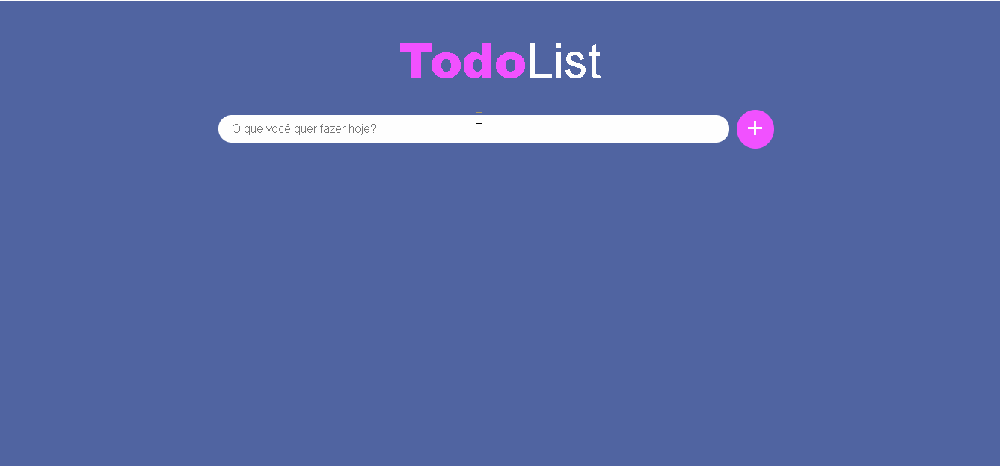

<h1 align="center">TodoList</h1> 

Uma aplicação Web para criação de lista de tarefas feita com ReactJS

### :mag: Sobre o projeto 
O Todo List é um sistema web que consiste na criação de uma lista de tarefas. É possível criar, excluir e marcar como conclúidas ou desmarcar. Este projeto foi feito para consolidação dos estudos e composição do portfólio.

### 🛠 Tecnologias

Utilizei conceitos de HTML, CSS, Javascript, ReactJS com hooks, styled-components.

### :key: Executar a aplicação

Clone este repositório
$ git clone https://github.com/raissaboeng/todolist-react.git

É necessário possuir node ou yarn instalados.

Abra a pasta do projeto pelo seu terminal.

Dentro da pasta do projeto pelo terminal executar o comando
$ npm start

Caso use Yarn
$ yarn start

### :bulb: Melhorias
- [x] Ao marcar uma tarefa como concluída, deixar o label riscado;
- [ ] Ao tentar adicionar alguma tarefa, verificar se ela já existe na lista e caso tenha não adicionar;
- [ ] Criar a opção de editar a tarefa;
- [ ] Conectar a aplicação a um banco de dados para não perder as tarefas ao atualizar ou fechar a página;
- [ ] Colocar animação de fundo;
